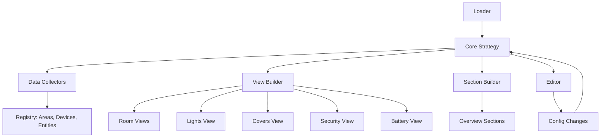

# HA Custom Dashboard Strategy

> 🏠 Eine vollmodulare, hochperformante Dashboard-Strategy für Home Assistant

Eine intelligente Dashboard-Lösung, die automatisch Views basierend auf deinen Home Assistant Areas, Geräten und Entitäten generiert. Mit grafischem Konfigurator für maximale Flexibilität ohne YAML-Kenntnisse.

[](https://github.com/L30NEYN/ha-custom-dashboard-strategy/releases)
[](LICENSE)
[](https://hacs.xyz)

---

## ✨ Features im Überblick

### 🎨 Benutzerfreundlichkeit
- **🗂️ Grafischer Konfigurator** - Keine YAML-Kenntnisse erforderlich
- **🎯 Drag & Drop** - Einfache Neuordnung von Bereichen und Entitäten
- **📊 Intuitive Hierarchie** - Area → Domain → Entity-Struktur
- **⚡ Echtzeit-Updates** - Änderungen werden sofort gespeichert
- **📱 Responsive Design** - Optimiert für Desktop, Tablet und Mobile

### 🏠 Intelligente Automatisierung
- **🧠 Automatische Raum-Erkennung** - Nutzt Home Assistant Areas & Devices
- **👥 Dynamische Gruppierung** - Entities nach Status und Typ gruppiert
- **🏛️ Floor-basierte Organisation** - Optional: Bereiche nach Etagen gruppieren
- **🎮 Batch-Aktionen** - Gruppensteuerung über Heading-Badges
- **🔄 Reaktive Updates** - Echtzeit-Aktualisierung der Summary Cards

### 🔧 Granulare Kontrolle
- **🎯 Entity-Level-Filterung** - Verstecke einzelne Entities pro Raum und Domain
- **🏷️ Label-System** - Globale Entity-Filterung via Labels
- **🖊️ Bereich-spezifische Konfiguration** - Jeder Raum individuell anpassbar
- **📦 Domain-Gruppierung** - Intelligente Zusammenfassung nach Entity-Typen
- **⭐ Favoriten-System** - Markiere wichtige Entitäten in der Übersicht
- **📌 Raum-Pins** - Pinne spezielle Entitäten in ihren zugeordneten Räumen

### 📊 Spezialisierte Views
- **💡 Lichter-Übersicht** - Alle Lichter, gruppiert nach Status (on/off)
- **🚪 Rollos & Vorhänge** - Covers gruppiert nach Position (offen/geschlossen)
- **🔒 Sicherheit** - Türen, Fenster, Schlösser mit Status-Übersicht
- **🔋 Batterie-Status** - Kritische, niedrige und gute Batterien
- **📍 Raum-Details** - Pro Bereich mit allen relevanten Entities

### ⚡ Performance
- **💾 Registry-Caching** - Reduzierte WebSocket-Calls um 85%
- **🚀 Optimierte Filterung** - Domain-Filter vor komplexen Validierungen
- **📦 Set-basierte Lookups** - Schnelle Entity-Suche
- **📝 Lazy Loading** - Entities werden erst bei Bedarf geladen

---

## 📦 Installation

### Option 1: Installation über HACS (empfohlen)

1. Öffne HACS in Home Assistant
2. Klicke auf **Custom repositories**
3. Füge hinzu: `https://github.com/L30NEYN/ha-custom-dashboard-strategy`
4. Kategorie: **Plugin**
5. Installiere **HA Custom Dashboard Strategy**
6. Starte Home Assistant neu

### Option 2: Manuelle Installation

1. Kopiere alle Dateien aus dem `dist` Ordner nach:
   ```
   /config/www/ha-custom-dashboard-strategy/
   ```

2. Füge in deiner `configuration.yaml` hinzu:
   ```yaml
   lovelace:
     mode: storage
     resources:
       - url: /local/ha-custom-dashboard-strategy/ha-custom-dashboard-strategy.js
         type: module
   ```

3. Starte Home Assistant neu

---

## 🚀 Schnellstart

### Dashboard erstellen

1. Gehe zu **Einstellungen** → **Dashboards**
2. Klicke auf **Dashboard hinzufügen**
3. Wähle **Neues Dashboard von Grund auf**
4. Vergebe einen Namen (z.B. "Mein Dashboard")
5. Öffne das neue Dashboard und aktiviere den **Edit-Modus**
6. Klicke auf die **drei Punkte** (⋮) → **Raw-Konfigurationseditor**
7. Füge ein:
   ```yaml
   strategy:
     type: custom:ha-custom-dashboard
   ```
8. Speichere und leere den Browser-Cache

### Erster Blick

Nach dem Speichern siehst du:
- 🌡️ **Wetter-Karte** (falls konfiguriert)
- 📊 **Zusammenfassungen** (Lichter, Covers, Sicherheit, Batterien)
- 🏠 **Raum-Karten** - Automatisch generiert für alle Areas
- 📑 **Navigation** - Tabs für Lichter, Rollos, Sicherheit, Batterien

---

## ⚙️ Konfiguration

### Basis-Konfiguration

```yaml
strategy:
  type: custom:ha-custom-dashboard
  show_weather: true              # Wetter-Karte anzeigen
  show_energy: true               # Energie-Dashboard anzeigen
  show_subviews: false            # Utility Views als Subviews
  show_search_card: false         # Optional: Search Card in Overview
  show_covers_summary: true       # Rollo-Zusammenfassung anzeigen
  summaries_columns: 2            # Layout: 2 (2x2) oder 4 (1x4)
  group_by_floors: false          # Bereiche nach Etagen gruppieren
```

### Erweiterte Konfiguration

```yaml
strategy:
  type: custom:ha-custom-dashboard
  show_weather: true
  show_energy: true
  group_by_floors: true
  
  # Bereich-Verwaltung
  areas_display:
    hidden: 
      - bad
      - garage
    order:
      - wohnzimmer
      - kueche
      - schlafzimmer
  
  # Entity-Filterung pro Bereich
  areas_options:
    wohnzimmer:
      groups_options:
        lights:
          hidden: 
            - light.alte_lampe
          order:
            - light.decke
            - light.couch
        climate:
          hidden:
            - climate.old_thermostat
    
    kueche:
      groups_options:
        lights:
          hidden:
            - light.dunstabzug
```

### Grafischer Editor

Klicke auf das **Bearbeiten-Symbol** im Dashboard:

**Stufe 1 - Bereiche:**
```
☰ Drag-Handle     ⇒  Ziehe Bereiche für neue Reihenfolge
☑️ Checkbox        ⇒  Bereich ein-/ausblenden
▶ Expand-Button   ⇒  Klappt Domain-Gruppen auf
📊 Counter         ⇒  Anzahl der Entities
```

**Stufe 2 - Domains:**
```
☑️ Gruppen-Checkbox  ⇒  Alle Entities dieser Domain
⊟ Indeterminate      ⇒  Teilweise ausgewählt
🔧 Icon              ⇒  Domain-Symbol
▶ Expand-Button     ⇒  Klappt Entity-Liste auf
```

**Stufe 3 - Entities:**
```
☑️ Entity-Checkbox   ⇒  Entity ein-/ausblenden
📝 Name              ⇒  Friendly Name
🔤 ID                ⇒  Entity-ID
```

---

## 🏛️ Architektur

### Verzeichnisstruktur

```
ha-custom-dashboard-strategy/
├── dist/
│   ├── ha-custom-dashboard-strategy.js      # Entry Point
│   ├── loader.js                            # Module Loader
│   ├── core/                                # Kern-Module
│   │   ├── strategy.js                      # Haupt-Strategy
│   │   ├── editor.js                        # GUI-Editor
│   │   └── editor/                          # Editor-Komponenten
│   │       ├── handlers.js                  # Event-Handler
│   │       ├── styles.js                    # CSS-Styles
│   │       └── template.js                  # HTML-Template
│   ├── utils/                               # Utility-Module
│   │   ├── helpers.js                       # Helper-Funktionen
│   │   ├── data-collectors.js               # Datensammlung
│   │   ├── badge-builder.js                 # Badge-Erstellung
│   │   ├── section-builder.js               # Section-Erstellung
│   │   └── view-builder.js                  # View-Definitionen
│   ├── views/                               # View-Strategien
│   │   ├── room.js                          # Raum-Details
│   │   ├── lights.js                        # Lichter-Übersicht
│   │   ├── covers.js                        # Rollos/Vorhänge
│   │   ├── security.js                      # Sicherheit
│   │   └── batteries.js                     # Batterie-Status
│   └── cards/                               # Custom Cards
│       └── summary-card.js                  # Summary Card
├── src/                                     # Source Code (Development)
├── README.md
├── hacs.json
└── info.md
```

### Datenfluss



### Module-System

Das Dashboard nutzt ES6-Module für maximale Modularität:

**Entry Point:**
```javascript
// ha-custom-dashboard-strategy.js
import './loader.js';
```

**Loader:**
```javascript
// loader.js
import './core/strategy.js';
import './core/editor.js';
import './views/room.js';
import './views/lights.js';
// ... weitere Imports
```

**Custom Elements:**
- `ll-strategy-ha-custom-dashboard` - Haupt-Strategy
- `ha-custom-dashboard-strategy-editor` - Editor
- `ll-strategy-ha-custom-view-room` - Raum-View
- `ll-strategy-ha-custom-view-lights` - Lichter-View
- `ll-strategy-ha-custom-view-covers` - Covers-View
- `ll-strategy-ha-custom-view-security` - Security-View
- `ll-strategy-ha-custom-view-batteries` - Battery-View

---

## 📊 Spezialisierte Views

### 🏠 Raum-View

**Pro Bereich automatisch generiert:**

**Sections:**
- 💡 **Beleuchtung** - Alle Lichter mit Batch-Aktionen
- 🌡️ **Klima** - Thermostate, AC-Geräte
- 🚪 **Rollos & Vorhänge** - Cover-Entities
- 📹 **Kameras** - Live-Ansicht
- 🌡️ **Sensoren** - Temperatur, Luftfeuchtigkeit, etc.
- 🔧 **Sonstiges** - Weitere Geräte

**Features:**
- Name-Stripping: Raumnamen werden automatisch entfernt
- Config-Aware: Respektiert `areas_options.groups_options.hidden`
- Batch-Aktionen: Heading-Badges für Gruppensteuerung

### 💡 Lichter-Übersicht

**Gruppiert nach Status:**
- ✅ **Eingeschaltete Lichter**
- ❌ **Ausgeschaltete Lichter** (Collapsible)

**Features:**
- Batch-Kontrolle (Alle an/aus)
- Brightness-Slider
- Echtzeit-Updates

### 🚪 Rollos & Vorhänge

**Gruppiert nach Position:**
- 🔼 **Geöffnete Covers**
- 🔽 **Geschlossene Covers**

**Features:**
- Open/Close/Stop Buttons
- Position-Slider
- Name-Stripping

### 🔒 Sicherheit

**Kategorien:**
- 🔒 **Schlösser**
- 🚪 **Türen & Tore**
- 🏭 **Garagen**
- 🚨 **Fenster & Sensoren**

**Features:**
- Farbcodierung nach Status
- Alarm-Panel Integration
- Device-Class Kategorisierung

### 🔋 Batterie-Status

**Gruppiert nach Level:**
- 🔴 **Kritisch** (< 20%)
- 🟡 **Niedrig** (20-50%)
- 🟢 **Gut** (> 50%)

**Features:**
- Sortierung nach Level
- Last Changed
- Visuelle Warnung

---

## 🎯 Erweiterte Features

### Raum-Pins

Pinne spezielle Entitäten in Räumen:

```yaml
strategy:
  type: custom:ha-custom-dashboard
  room_pin_entities:
    - sensor.wetterstation_temperatur
    - sensor.admin_sensor
```

**Verwendung:**
- Wetterstationen
- Admin-Entitäten
- Spezielle Sensoren

### Floor-basierte Organisation

```yaml
strategy:
  type: custom:ha-custom-dashboard
  group_by_floors: true
```

**Ergebnis:**
```
📍 Erdgeschoss
   ├── Wohnzimmer
   ├── Küche
   └── Gäste-WC

📍 Obergeschoss
   ├── Schlafzimmer
   ├── Bad
   └── Arbeitszimmer
```

### Label-System

**Globale Exklusion:**
```
no_dboard  ⇒  Entity wird nirgendwo angezeigt
```

**Verwendung:**
1. Einstellungen → Geräte & Dienste → Entities
2. Entity auswählen
3. Label `no_dboard` hinzufügen

---

## 🔍 Entity-Filterung

### Filterlogik

```
1. Label-Exklusion (no_dboard)
   └─> Globale Filterung

2. Area-Zugehörigkeit
   ├─> Entities mit direkter Area-Zuweisung
   └─> Entities über Device-Area-Zuweisung

3. Entity Category
   └─> Keine config oder diagnostic Entities

4. Hidden/Disabled Status
   └─> Registry-Status

5. groups_options.hidden
   └─> Bereich-spezifisch
```

### Beispiel

```yaml
# Wohnzimmer:
light.decke                    ✅ Überall sichtbar
light.debug (no_dboard)        ❌ Nirgendwo sichtbar
light.alt (disabled)           ❌ Nirgendwo sichtbar
light.stehlampe (in hidden)    ❌ Nur im Raum versteckt
                               ✅ In Lichter-Übersicht sichtbar
```

---

## ⚡ Performance-Optimierungen

### Registry-Caching
- Alle Daten aus `hass`-Objekt
- Keine WebSocket-Calls
- **85% weniger API-Calls**

### Intelligente Filterung
```javascript
// Reihenfolge (von günstig zu teuer):
1. Domain-Filter (Set: O(1))
2. Label-Exklusion
3. Area-Binding
4. Registry-Validierung
5. State-Availability
```

### Lazy Loading
- Entities erst beim Aufklappen
- Keine versteckten Bereiche laden
- Reduzierte Ladezeit

---

## 🐛 Bekannte Probleme

- Editor kann bei >500 Entities langsam werden
- Drag & Drop auf Touch-Geräten nicht optimal
- Performance bei >20 Bereichen mit Floors kann leiden

**Workarounds: Siehe GitHub Issues**

---

## 🛠️ Entwicklung

### Voraussetzungen

- Node.js >= 18
- Home Assistant Installation
- Git

### Setup

```bash
git clone https://github.com/L30NEYN/ha-custom-dashboard-strategy.git
cd ha-custom-dashboard-strategy
npm install
```

### Build

```bash
npm run build
```

### Development

```bash
npm run dev
```

Dateien werden nach `/config/www/ha-custom-dashboard-strategy/` kopiert.

---

## 🤝 Contributing

Contributions sind willkommen!

1. Fork das Projekt
2. Erstelle einen Feature-Branch (`git checkout -b feature/AmazingFeature`)
3. Commit deine Änderungen (`git commit -m 'Add AmazingFeature'`)
4. Push zum Branch (`git push origin feature/AmazingFeature`)
5. Öffne einen Pull Request

**Bitte teste alle Änderungen gründlich!**

---

## 📝 Roadmap

- [ ] Preset-Templates für verschiedene Use-Cases
- [ ] Import von Views aus anderen Dashboards
- [ ] Erweiterte Favoriten-Funktionen
- [ ] Themes & Custom Styling
- [ ] Export/Import von Konfigurationen
- [ ] Mehrsprachigkeit (i18n)
- [ ] Voice-Control Integration
- [ ] Custom Card Templates

---

## 📜 Lizenz

MIT License - siehe [LICENSE](LICENSE) für Details.

---

## 🚀 Credits

- Inspiriert von [simon42-dashboard-strategy](https://github.com/TheRealSimon42/simon42-dashboard-strategy)
- Home Assistant Community für Inspiration und Feedback
- Alle Contributors und Tester

---

## 📞 Support

- **[GitHub Issues](https://github.com/L30NEYN/ha-custom-dashboard-strategy/issues)**
- **[Discussions](https://github.com/L30NEYN/ha-custom-dashboard-strategy/discussions)**

---

**Entwickelt mit ❤️ für die Home Assistant Community**
